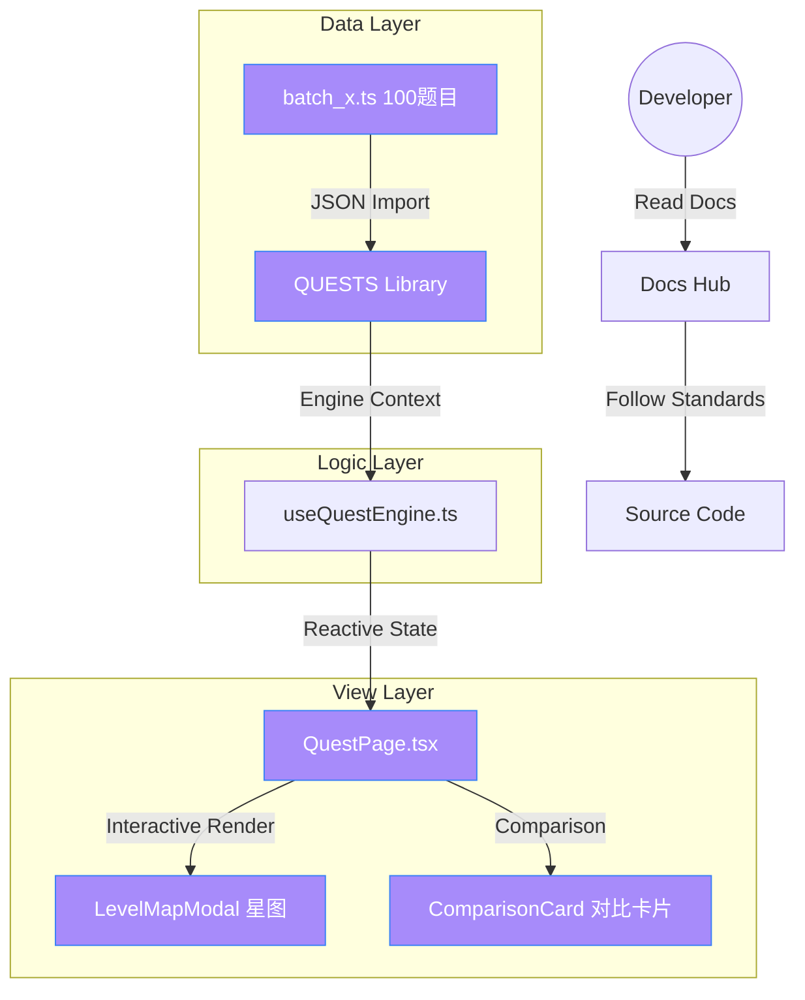

# ⚔️ React Quest Laboratory (React 闯关实验室)

> **"Master React via the lens of Vue, Level by Level."**
>
> 本项目是一个专为 Vue 开发者设计的 React 沉浸式学习平台。通过 100 道对比关卡与一套“星图大航海”全息地图，带你从零通过底层认知藩篱。

---

## 🗺️ 文档导航中心 (Documentation Hub)

为了确保项目的长期自治与 AI 协作效率，我们建立了一套**分级分布式文档系统**。

### 核心规约 (Core Specifications)
- 🏗️ [**项目目录结构**](docs/PROJECT_STRUCTURE.md) - 定义目录职责边界。
- 📋 [**开发指南 & 工作流**](docs/DEVELOPMENT_GUIDE.md) - 如何开始编码、分支与提交。
- 🎨 [**设计系统 (Design System)**](docs/DESIGN_SYSTEM.md) - 星海主题配色与 UI Tokens。
- 🔐 [**技术栈版本基准**](docs/TECH_STACK.md) - 核心依赖版本记录。
- 🕰️ [**架构演进与历史决策**](docs/ARCHITECTURE_EVOLUTION.md) - 压缩并提取的重大 Plan 决策背景。

### 维护与质量 (Maintenance & Quality)
- 🧪 [**测试策略与规约**](docs/TESTING.md) - 自动化 QA 范式。
- 🚢 [**部署与生产预检**](docs/DEPLOYMENT.md) - 环境配置与构建指令。
- 🛠️ [**故障排查与常见问题**](docs/TROUBLESHOOTING.md) - 样式库覆盖、语法陷阱等实战坑点。

---

## 🏛️ 系统架构全景 (System Architecture)



---

## ✨ 核心特性 (Key Features)

- **100 道全量级闯关**：涵盖从 JSX 到 React 19 Concurrent Lane 模型的所有技术阶梯。
- **Vue 原生对比教学**：所有题目均包含 `vueFeature` 对标解析，消除跨框架心理门槛。
- **星海全息地图导航**：10 大大区、内置呼吸灯与响应式 Grid 排版。
- **全系 TS 类型驱动**：严苛的类型屏障，确保在大型重构中逻辑立于不败之地。

## 🚀 快速启动 (Quick Start)

```bash
# 安装依赖
npm install

# 启动闯关模式
npm run dev

# 执行全库质量扫描
npm run lint
```

---

> [!IMPORTANT]
> **开发指南**: 在您进行任何重大 Feature 更新前，请务必先查阅 [docs/DEVELOPMENT_GUIDE.md](docs/DEVELOPMENT_GUIDE.md) 以确保 Git 提交记录的整洁。

*Copyright © 2026 React Quest Lab Team. Built for the next generation of React Alchemists.*
